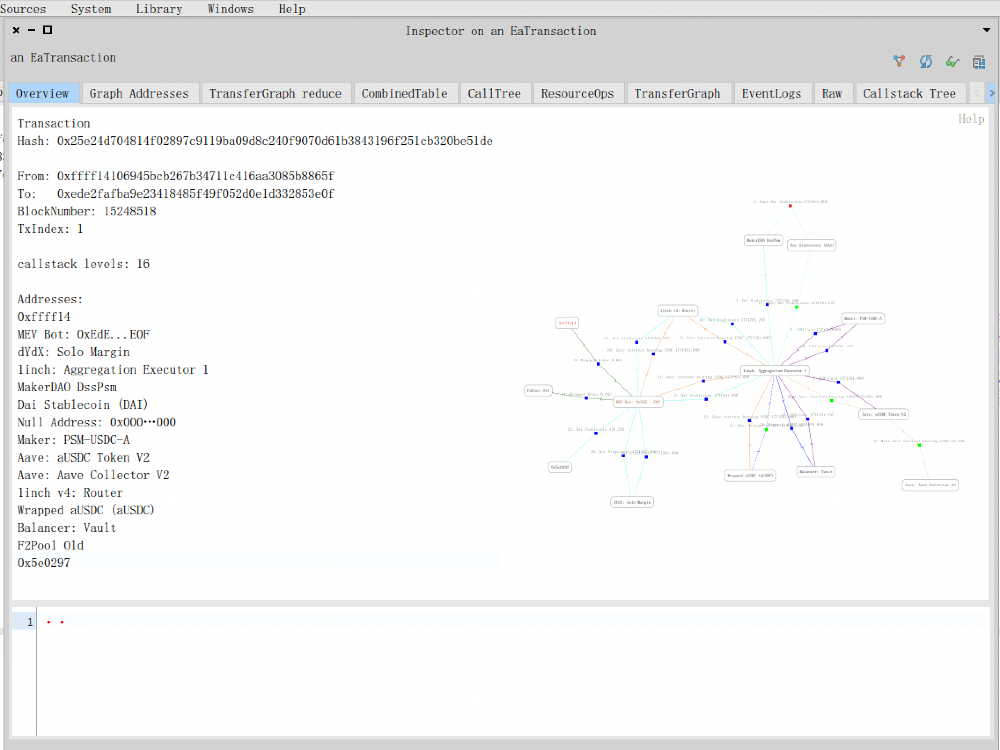
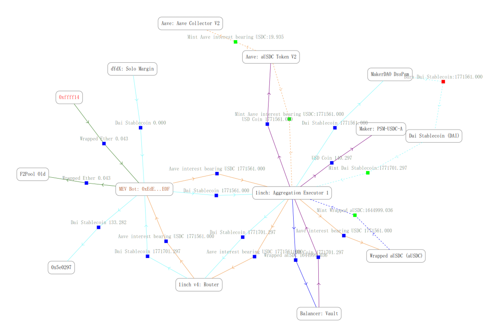
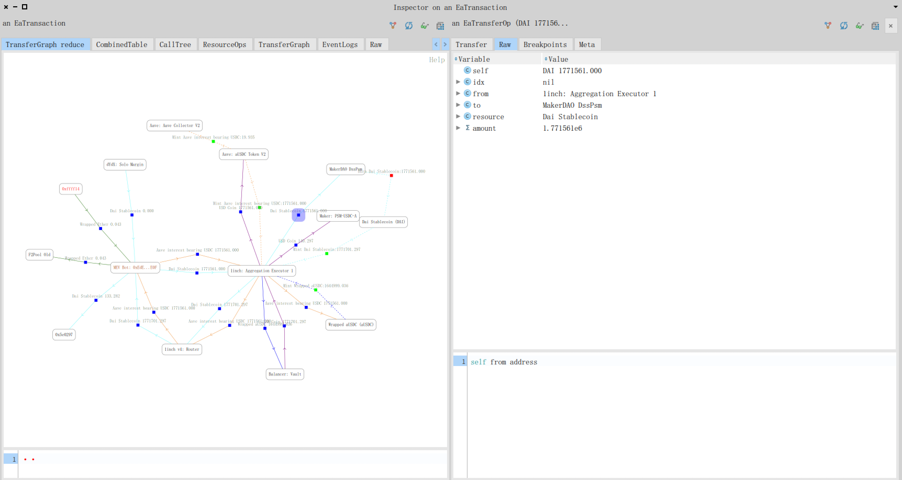
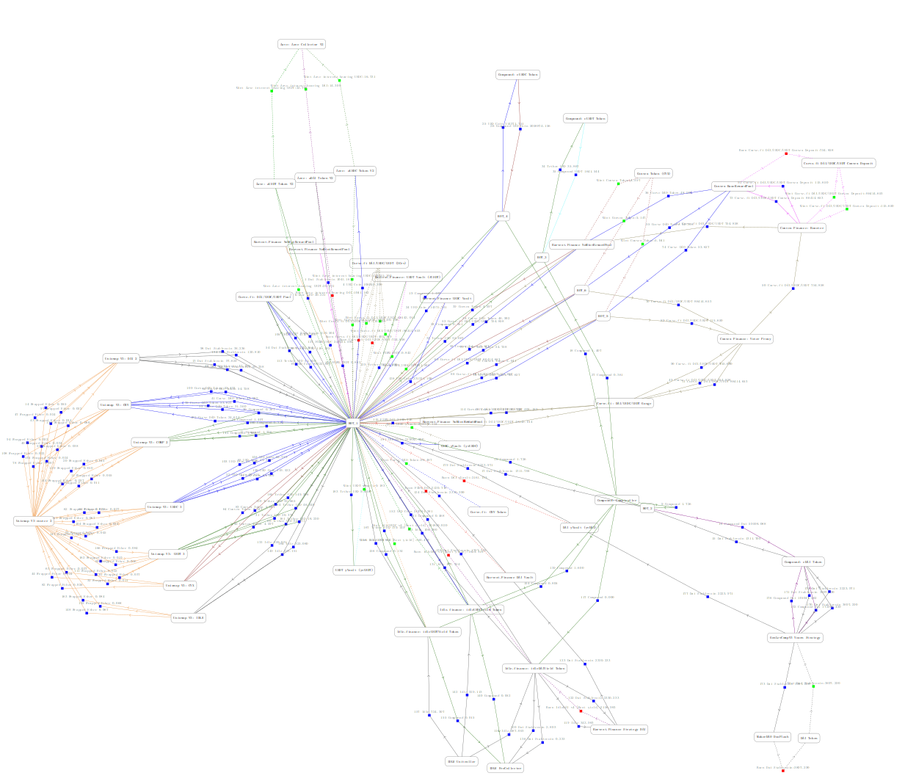
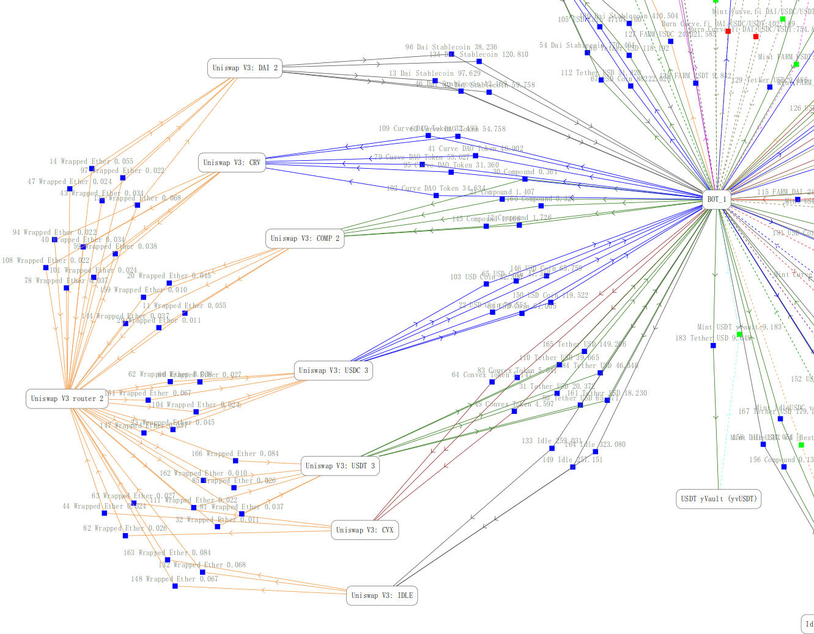
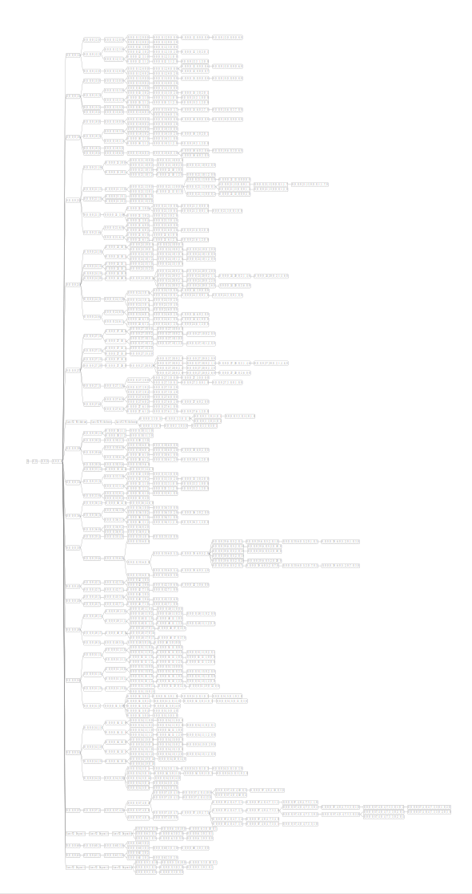
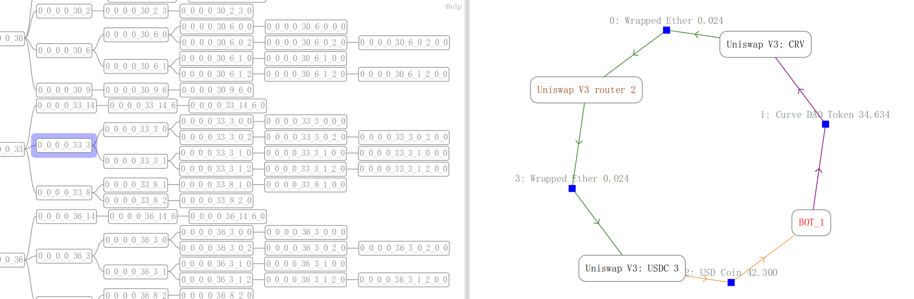
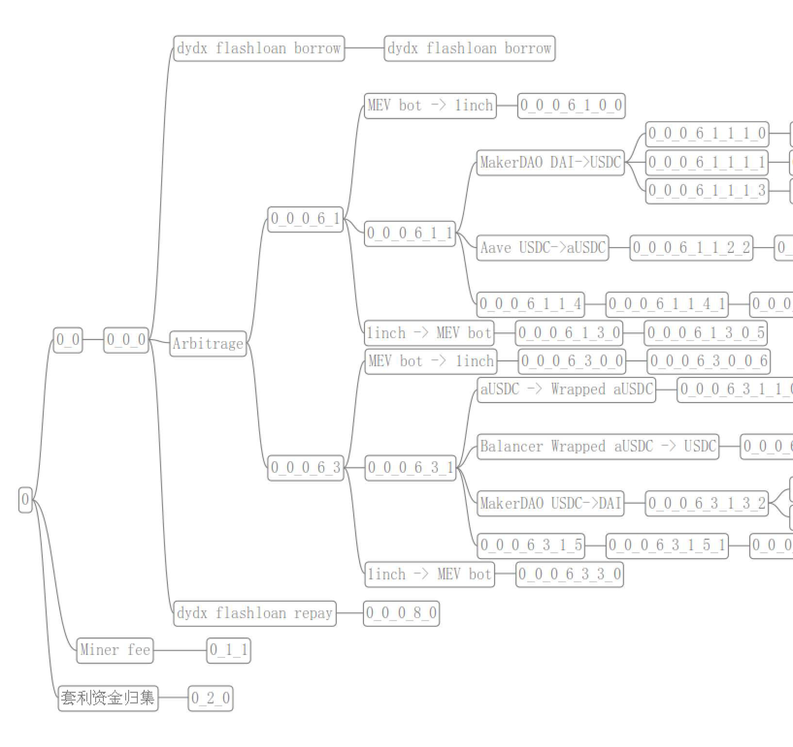
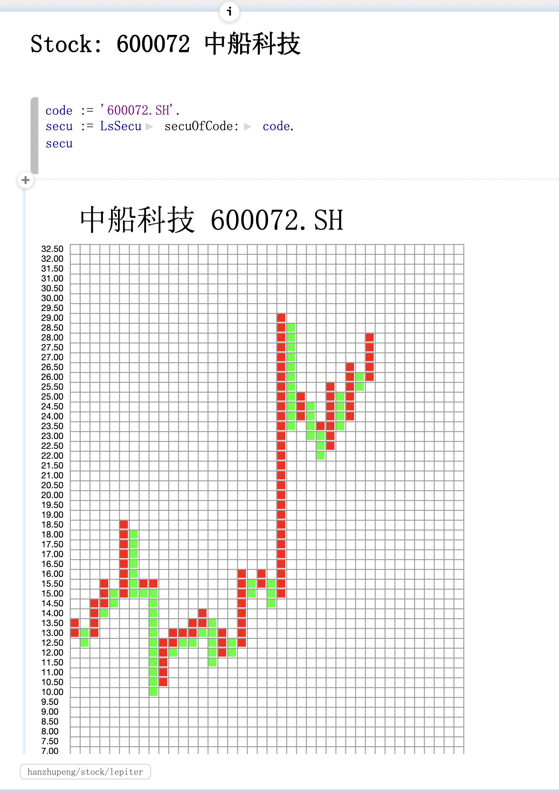

# Pharo/Gtoolkit as personal information environment

by: albertlee (hanzhupeng@gmail.com)

## Using Pharo as Ethereum Transaction analyse tool

There are many complex DeFi contract transactions on Ethereum, such as swaps/lendings etc. Many of them are extremely complex:arbitrages, fund operations.

In 2022, in order to analyze these transactions, I use Pharo as an analysis tool, not just a tool, but also an environment to explore.

Because our knowledge in these fields is constantly exploring and learning, we especially need an environment that is convenient for improvement. In this process, the model in the domain is gradually evolved, and a tool is developed that can explore all aspects of a complex transaction.

We abstract some basic domain objects, such as Transaction, Transfer, Address, Token, Callstack etc.

Using the Inspector as the main interface. While observing it through the inspector, ask various questions to it, and get the result directly through the smalltalk code. Turn satisfactory snippet code into a fixed function.

For the visualization of the transaction process, Roassal is used for drawing.

For some relatively simple transactions, a graphical representation is sufficient.
For example a simple arbitrage transaction:

We can view a specific object, such as a specific transfer, or an Address, by clicking a node on the graph. You can view its various properties.

However, we come across a super complex transaction example:

[A complex Transaction](https://etherscan.io/tx/0xad4cae73ea8d139eb3f01ba80c6564bdfcea31d322415a4788d69618f7e5bb83)

Zoom in:

To analyze it, I developed new tree view tool. According to the callstack tree, analyze it layer by layer.

Then you can analyze and understand step by step through branches:

There are many patterns that have been identified. By strengthening the tool, we quickly understood the entire complex transaction.

## From Pharo to gtoolkit

I have used gtoolkit in 2021, but I encountered some bugs in the process of using it, and I am not very familiar with the use of gt. The latest version is pretty good, so I'm using it back. I started to use gtoolkit as a tool to help me trade stocks. It is not just a tool for drawing or quantifying stock selection, but a comprehensive environment that includes transaction notes and analysis of the thinking process.

With the experience of Ethereum Transaction Analysis tools last year, I understand some things better.
In the use of Pharo, we ignore an important factor: the story.

The process by which we build models from scratch, from formulating problems and hypotheses to solving them, does not persist explicitly in Pharo's environment, but exists implicitly in the version history. This may be related to the fact that the Smalltalk environment is generally regarded as an IDE (Development) environment. For analysis tasks, the process of exploring and analyzing is an element that cannot be ignored.

I'm not trying to compare who is better, but gtoolkit's explicit support for note telling stories will change the way we look at problem solving.